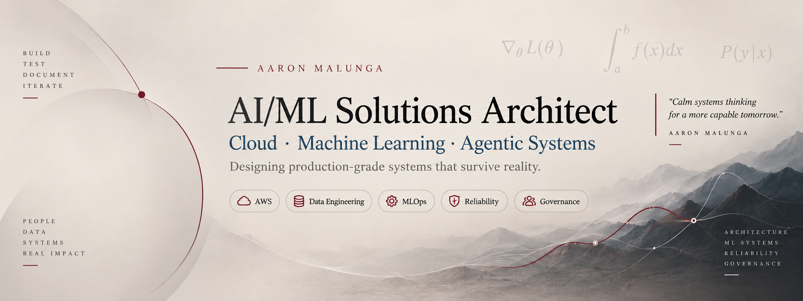

<p align="center">
  
</p>

<p align="center">
  <a href="https://github.com/aaronmalunga"></a>
  <a href="https://www.linkedin.com/in/aaronmalunga/"></a>
</p>

---

## What I build

I work at the intersection of **cloud architecture, machine learning, data systems, and agentic AI**.

My portfolio is intentionally structured around systems that have to survive more than a demo: **failure, security boundaries, cost constraints, governance, observability, human approval, changing data, and operational ownership**.

> **Architecture principle:** intelligence does not automatically imply authority.

---

## Featured systems

### 01 · Reliora
**Agentic AI reliability & control platform**

A production-oriented customer-support platform designed around controlled autonomy, deterministic authorization, idempotency, human approval, observability, security, privacy, and measurable operational evidence.

**Architecture focus**  
`Agentic AI` · `AWS` · `Terraform` · `HITL` · `Observability` · `Governance`

**Evidence**  
`200+ local tests` · `RL0–RL3 autonomy controls` · `IaC` · `ADRs`

**Status:** In development

---

### 02 · Secure AI Capability Orchestration
**Enterprise AI integration**

A secure enterprise AI platform connecting identity, governed tool access, retrieval, cross-session memory, and business systems through explicit authorization boundaries.

**Architecture focus**  
`Identity` · `RAG` · `Memory` · `Tool Use` · `Security`

**Status:** Planned / in build

---

### 03 · Distributed Agent Workflow Platform
**Multi-agent systems**

A production-oriented multi-agent workflow platform focused on orchestration, task ownership, AgentOps, failure recovery, inter-agent contracts, and end-to-end observability.

**Architecture focus**  
`Multi-Agent` · `AgentOps` · `Orchestration` · `Reliability`

**Status:** Planned

---

### 04 · Experimentation & Causal Decision Platform
**Data Science**

A decision-science project using experimentation, statistical inference, causal reasoning, and SQL-driven analysis to move from observational data to defensible business decisions.

**Architecture focus**  
`Statistics` · `Causal Inference` · `SQL` · `Experimentation`

**Status:** Planned

---

### 05 · Real-Time Fraud & Risk Decisioning
**Machine Learning**

A low-latency ML risk system covering feature pipelines, calibrated predictions, threshold design, online inference, monitoring, and operational decision trade-offs.

**Architecture focus**  
`Risk Modeling` · `Calibration` · `Streaming` · `MLOps`

**Status:** Planned

---

### 06 · Personalized Retrieval & Ranking
**Machine Learning**

An online recommendation and ranking system combining candidate retrieval, learning-to-rank, personalization, offline evaluation, and production feedback loops.

**Architecture focus**  
`Recommendations` · `Ranking` · `Personalization` · `Online ML`

**Status:** Planned

---

## Technical stack

### Cloud & AI

<p>
  
  
  
  
  
</p>

### Machine Learning & Data

<p>
  
  
  
  
  
</p>

### Infrastructure & Engineering

<p>
  
  
  
  
  
</p>

---

## How I think about architecture

| Principle | What it means in practice |
|---|---|
| **Start with failure** | Define what can fail, who absorbs the damage, and how the system recovers before selecting services. |
| **Separate intelligence from authority** | A model may recommend an action without automatically receiving permission to execute it. |
| **Design for evidence** | Important architecture claims should be supported by tests, metrics, logs, experiments, or written decisions. |
| **Treat cost as architecture** | Idle infrastructure, scaling behavior, and teardown strategy are design decisions, not billing afterthoughts. |
| **Make operations explicit** | Ownership, observability, incident response, privacy, security, and human workflows are part of the product. |

---

## AWS certification roadmap

| Category | Credential | Status |
|---|---|---|
| **Foundational** | AWS Certified AI Practitioner | **Current focus** |
| **Business** | AWS Certified AI Business Strategist | Planned |
| **Foundational** | AWS Certified Cloud Practitioner | Planned |
| **Associate** | AWS Certified Solutions Architect | Planned |
| **Associate** | AWS Certified Data Engineer | Planned |
| **Associate** | AWS Certified Machine Learning Engineer | Planned |

> Earned credentials will link to personal Credly verification. Planned credentials are shown as a roadmap, not as credentials already held.

---

## Architecture notebook

I keep a public trail of technical reasoning rather than only publishing finished screenshots.

- **Autonomy Policy for Agentic Systems** — risk levels, approvals, reversibility, and execution authority
- **Architecture Decision Records** — explicit trade-offs and why a decision was made
- **Reliability & Operations Notes** — observability, incidents, ownership, privacy, and security
- **AWS AI/ML Learning Ledger** — implementation lessons connected to certification concepts and real systems

---

## Selected engineering evidence

```text
Reliora
├── 200+ local tests
├── RL0–RL3 autonomy controls
├── Terraform infrastructure
├── deterministic authorization
├── human approval paths
├── observability + incident evidence
└── architecture decision records
```

The goal is not to maximize repository count.  
The goal is to make each serious project **inspectable**.

---

## Currently

```text
→ Building        Reliora
→ Studying        AWS Certified AI Practitioner
→ Deepening       AWS architecture, data engineering, MLOps
→ Exploring       reliable agentic systems and production ML
```

---

<p align="center">
  <b>Cloud · Machine Learning · Agentic Systems</b><br/>
  <sub>Systems &gt; spectacle.</sub>
</p>
